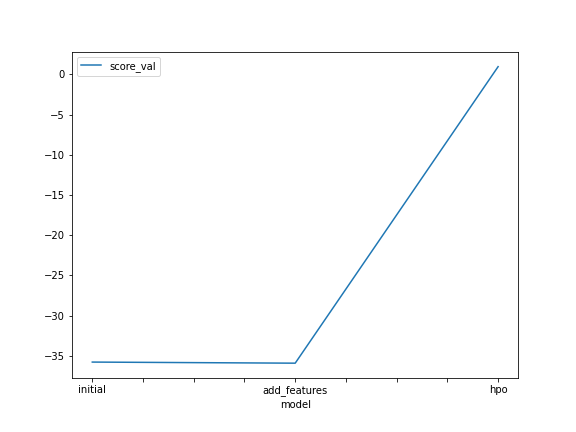
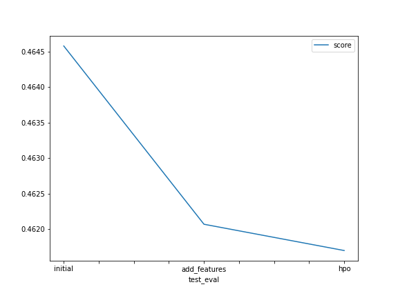

# Report: Predict Bike Sharing Demand with AutoGluon Solution
#### Chunni Jiang

## Initial Training
### What did you realize when you tried to submit your predictions? What changes were needed to the output of the predictor to submit your results?
I realized that many steps were left out before the first submission.

First, we need to carry out Exploratory Data Analysis. Some data need further processing. Forexample, I didn't set season and weather to data type "category". Instead, they were put into model in the form of "int", which doesn't make any sense. Also, we should check histograms and correlation of features, maybe can try to add another new feature based on analysis before.

Second, we need to check the hyper parameters. In the first submission, I didn't tune the hyper parameters, so the result is not optimal.

Finally, I wasn't required to process datetime, but I still did so in the first submission.

### What was the top ranked model that performed?
The top ranked model has score of 0.46170. It processed datetime feature, made some features category features, added a new feature. Also, I tuned the hpyer parameters.

## Exploratory data analysis and feature creation
### What did the exploratory analysis find and how did you add additional features?
First, telling from the histogram, I can see that several features should be categories instead of integer values. For example, season, holiday, working day, and weather are distributed among 2 or 4 numbers, and the value itself doesn't make any sense, making them category features. 

Second, telling from the correlation map, most features are not much correlated with each other, so I didn't make new features by simply dividing or adding existing features.

In order to add additional features, I decided to go to the real world meaning of the problem. When using bikes, we tend to use them more when the weather is suitable. That means, when the temperature is neither too high or too low, and it has low humidity(no rain), we use bikes more. So I made a category feature by whether the day satisfies the conditions above.

### How much better did your model preform after adding additional features and why do you think that is?
The score improved 0.00251.

I think this is because temperature's influence on "count" is not linear, so if we extract information first, it will be easier for AutoGluon to process it.

## Hyper parameter tuning
### How much better did your model preform after trying different hyper parameters?
Compared with model that have new features, its score imporved 0.00037.

### If you were given more time with this dataset, where do you think you would spend more time?
I will spend more time on adding new features. Because all features are raw, if we can process it first, the input information would be more informative. Also, since AutoGluon has tried many models, I don't think that there would be much room for promotion in terms of model detials compared with features.

### Create a table with the models you ran, the hyperparameters modified, and the kaggle score.
|model|hpo1|hpo2|hpo3|score|
|--|--|--|--|--|
|initial|root_mean_squared_error|600|0.best_quality|0.46458|
|add_features|root_mean_squared_error|600|best_quality|0.46207|
|hpo|r2|900|best_quality|0.46170|

### Create a line plot showing the top model score for the three (or more) training runs during the project.

TODO: Replace the image below with your own.

### Create a line plot showing the top kaggle score for the three (or more) prediction submissions during the project.

## Summary
In conclusion, EDA is very important, and we should always process features before we actually use them. During the process, we can also create new features, that will help the model a lot. Also, AutoGluon is a powerful tool because it can automatically call various models and parameters. 